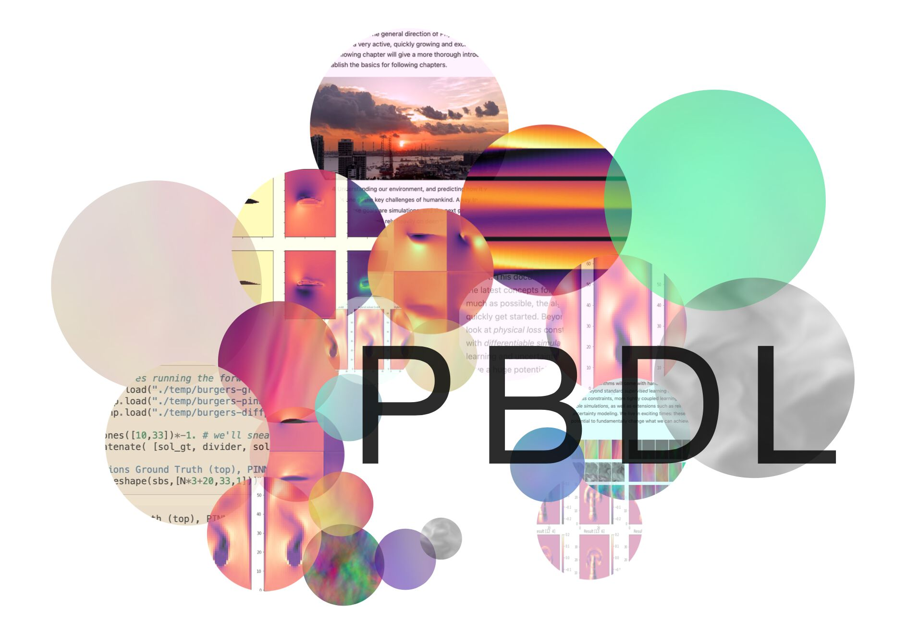

# Welcome to the Physics-based Deep Learning book (PBDL) v0.2

This is the source code repository for the Jupyter book "Physics-based Deep Learning". You can find the full, readable version online at:
[https://physicsbaseddeeplearning.org/](https://physicsbaseddeeplearning.org/)

A single-PDF version is also available on arXiv: https://arxiv.org/pdf/2109.05237.pdf 

# A Short Synopsis

The PBDL book contains a practical and comprehensive introduction of everything related to deep learning in the context of physical simulations. As much as possible, all topics come with hands-on code examples in the form of Jupyter notebooks to quickly get started. Beyond standard supervised learning from data, we’ll look at physical loss constraints, more tightly coupled learning algorithms with differentiable simulations, as well as reinforcement learning and uncertainty modeling. We live in exciting times: these methods have a huge potential to fundamentally change what we can achieve with simulations.

The key aspects that we will address in the following are:

* explain how to use deep learning techniques to solve PDE problems,
* how to combine them with existing knowledge of physics,
* without discarding our knowledge about numerical methods.

The focus of this book lies on:

* Field-based simulations (not much on Lagrangian methods)
* Combinations with deep learning (plenty of other interesting ML techniques exist, but won't be discussed here)
* Experiments as are left as an outlook (such as replacing synthetic data with real-world observations)

The name of this book, _Physics-based Deep Learning_, denotes combinations of physical modeling and numerical simulations with methods based on artificial neural networks. The general direction of Physics-Based Deep Learning represents a very active, quickly growing and exciting field of research.

The aim is to build on all the powerful numerical techniques that we have at our disposal, and use them wherever we can. As such, a central goal of this book is to reconcile the data-centered viewpoint with physical simulations.

The resulting methods have a huge potential to improve what can be done with numerical methods: in scenarios where a solver targets cases from a certain well-defined problem domain repeatedly, it can for instance make a lot of sense to once invest significant resources to train a neural network that supports the repeated solves. Based on the domain-specific specialization of this network, such a hybrid could vastly outperform traditional, generic solvers.

# What's new?

* For readers familiar with v0.1 of this text, the [extended section on differentiable physics training](http://physicsbaseddeeplearning.org/diffphys-examples.html)  and the
brand new chapter on [improved learning methods for physics problems](http://physicsbaseddeeplearning.org/diffphys-examples.html) are highly recommended starting points.

# Teasers

To mention a few highlights: the book contains a notebook to train hybrid fluid flow (Navier-Stokes) solvers via differentiable physics to reduce numerical errors. Try it out:
https://colab.research.google.com/github/tum-pbs/pbdl-book/blob/main/diffphys-code-sol.ipynb

In v0.2 there's new notebook for an improved learning scheme which jointly computes update directions for neural networks and physics (via half-inverse gradients):
https://colab.research.google.com/github/tum-pbs/pbdl-book/blob/main/physgrad-hig-code.ipynb

It also has example code to train a Bayesian Neural Network for RANS flow predictions around airfoils that yield uncertainty estimates. You can run the code right away here:
https://colab.research.google.com/github/tum-pbs/pbdl-book/blob/main/bayesian-code.ipynb

And a notebook to compare proximal policy-based reinforcement learning with physics-based learning for controlling PDEs (spoiler: the physics-aware version does better in the end). Give it a try:
https://colab.research.google.com/github/tum-pbs/pbdl-book/blob/main/reinflearn-code.ipynb

